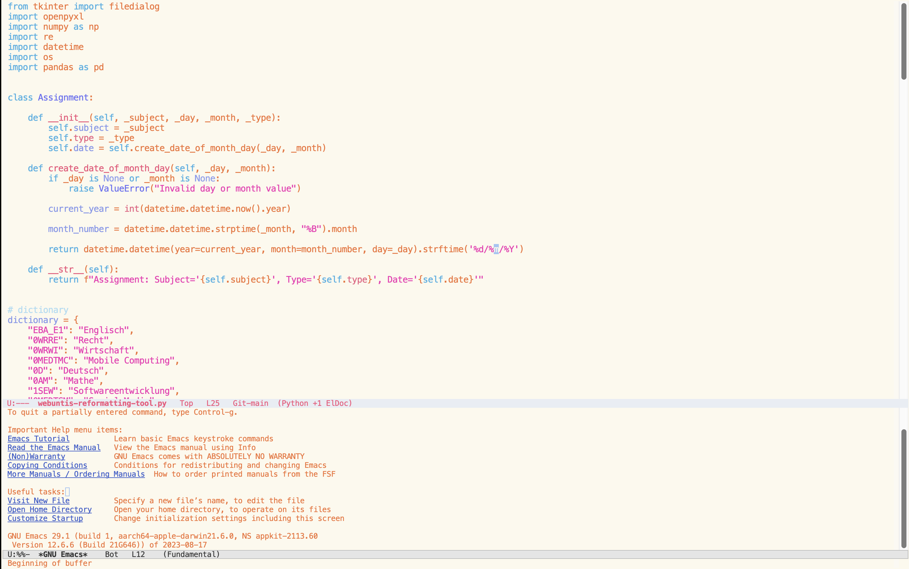

= EMACS Cotton-Candy-Them 
Stevan Vlajic
1.0.0, {docdate}: 
//:toc-placement!:  // prevents the generation of the doc at this position, so it can be printed afterwards
:sourcedir: ../src/main/java
:icons: font
:sectnums:    // Nummerierung der Überschriften / section numbering
:toc: left
:experimental:
			
== Editor-View

== How to set up 
* Get the Emacs text-editor
** Link: https://www.gnu.org/savannah-checkouts/gnu/emacs/emacs.html
** Open up the editor
** `ALT + X`
*** `package-install-file`
*** Install the theme: `{path}/emacs-cotton-candy.el`
** `ALT + X`
*** `load-theme`
**** `emacs-cotton-candy`

== Credits
* The theme was created with the Emacs-theme-builder
** Link: https://emacsfodder.github.io/emacs-theme-editor/